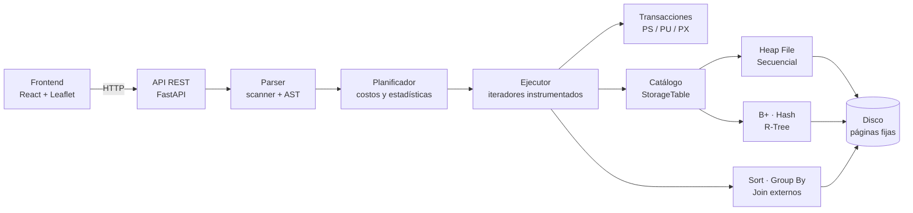

<div align="center">

# MiniGestor BD2

### Gestor de bases de datos multimodal construido desde cero

Archivos paginados · índices B+, hash y R-Tree · SQL con planificador por costos · `EXPLAIN ANALYZE` · transacciones · consultas espaciales sobre un mapa


</div>

---

## Qué hace

<table>
<tr>
<td width="50%" valign="top">

**Parte 1 · Relacional**

- Heap File con reutilización de espacio y archivo secuencial con reorganización
- Índices **B+ agrupado**, **B+ no agrupado** y **hash extensible**
- Índices secundarios con `CREATE INDEX`
- `ORDER BY`, `GROUP BY` y `JOIN` externos (k-way merge y grace hash join)
- `WHERE` con `AND`, `OR`, `NOT`, `BETWEEN`, `IN`, `LIKE`, `IS NULL`
- Varios `JOIN` encadenados con filtros bajados a cada tabla
- Valores `NULL` con semántica SQL
- Planificador por costos y `EXPLAIN` / `EXPLAIN ANALYZE` como PostgreSQL
- Transacciones con bloqueos PS / PU / PX

</td>
<td width="50%" valign="top">

**Parte 2 · Espacial**

- Tipo `POINT` y un **R-Tree en disco** por cada columna espacial
- Consultas por **radio**, **k vecinos más cercanos** y **polígono**
- Distancias **Haversine** (metros) y **Euclidiana**
- `distancia(...)` e `intersecta(...)` dentro del SQL
- El planificador elige el R-Tree por costo, también dentro de un `JOIN`
- Mapa interactivo con los resultados resaltados
- Visualización de los MBR del R-Tree por nivel

</td>
</tr>
</table>

## Inicio rápido

> [!NOTE]
> Requisitos: Python 3.11+, Node 18+ y [pnpm](https://pnpm.io) 9.

```bash
pnpm install
pnpm run setup
pnpm dev
```

Abre <http://localhost:5173>. El backend queda en el puerto 8000.

Para tener datos con los que probar, genera los CSV de demo (10 000 filas por tabla) e impórtalos desde el panel **Archivos**:

```bash
python3 data/generar_demo.py
```

La guía completa, con la configuración recomendada para cada tabla, está en [Instalación y primeros pasos](docs/01-instalacion.md).

## Una muestra del SQL

```sql
CREATE INDEX idx_pedidos_estado ON pedidos (estado) USING BPLUS;

EXPLAIN ANALYZE
SELECT t.distrito, COUNT(*), SUM(p.total)
FROM clientes c
JOIN pedidos p ON c.id = p.cliente_id
JOIN tiendas t ON p.tienda_id = t.id
WHERE p.estado = 'entregado'
  AND c.edad BETWEEN 25 AND 60
  AND distancia(t.ubicacion, mi_ubicacion) < 8000
GROUP BY t.distrito
ORDER BY t.distrito;
```

Cada tabla entra al `JOIN` por su mejor camino: `clientes` con un scan filtrado, `pedidos` con el índice secundario y `tiendas` con el R-Tree. La referencia completa está en [SQL](docs/02-sql.md).

## Arquitectura



## Documentación

| | Página | De qué trata |
|---|---|---|
| 🚀 | [Instalación y primeros pasos](docs/01-instalacion.md) | Requisitos, comandos, datos de demo y problemas comunes |
| 📝 | [SQL](docs/02-sql.md) | Referencia de todas las sentencias con ejemplos |
| 🧱 | [Arquitectura](docs/03-arquitectura.md) | Capas, recorrido de una consulta y estructura del repositorio |
| 💾 | [Almacenamiento](docs/04-almacenamiento.md) | Heap File, archivo secuencial y formato de registro |
| 🌳 | [Índices](docs/05-indices.md) | B+, hash extensible, índices secundarios y R-Tree |
| 🧠 | [Planificador y EXPLAIN](docs/06-planificador.md) | Modelo de costos, elección de índices, JOINs y algoritmos externos |
| 🔒 | [Transacciones](docs/07-transacciones.md) | Bloqueos, 2PL estricto y la simulación con hilos |
| 🗺️ | [Consultas espaciales](docs/08-espacial.md) | `POINT`, R-Tree, radio, k-NN, polígonos y métricas |
| 🖥️ | [Interfaz](docs/09-interfaz.md) | Recorrido por los paneles de la aplicación |
| ✅ | [Pruebas](docs/10-pruebas.md) | Cómo ejecutar las pruebas y qué cubren |
| ⚠️ | [Alcance y limitaciones](docs/11-limitaciones.md) | Lo que el sistema no hace |
| 📊 | [Benchmarks](benchmarks/README.md) | Comparación experimental de técnicas y resultados |

## Estructura del repositorio

```
Proyecto_BD2/
├── backend/
│   ├── api/                 API REST (FastAPI)
│   └── engine/
│       ├── storage/         Heap File y archivo secuencial
│       ├── bplus/           B+ no agrupado y agrupado
│       ├── hashing/         hash extensible y algoritmos externos por hash
│       ├── external/        ordenamiento externo
│       ├── parser/          scanner, parser, AST y ejecutor
│       ├── plan/            planificador, costos, nodos y EXPLAIN
│       ├── transactions/    transacciones y bloqueos
│       ├── rtree.py         R-Tree en disco
│       └── catalog.py       tablas, índices y estadísticas
├── frontend/                interfaz (React + Vite + Leaflet)
├── benchmarks/              notebook, script espacial y resultados
├── data/                    generadores de datos
└── docs/                    esta documentación
```

---

<div align="center">
Proyecto del curso <b>Base de Datos II</b> · Universidad de Ingeniería y Tecnología (UTEC) · 2026-2
</div>
