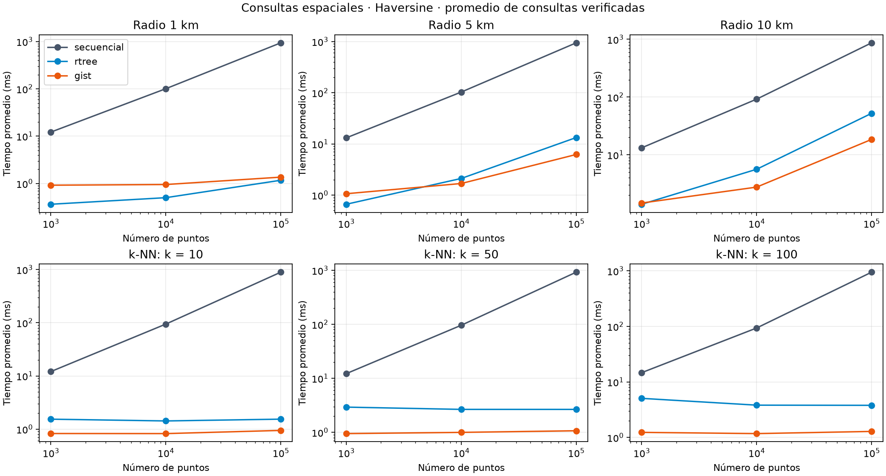
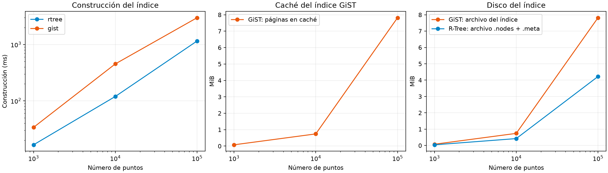

# Resultados de la comparación espacial

Corrida de la implementación actual iniciada el **2026-10-04T16:09:50-0500**: **1 800 consultas, cada una ejecutada con las tres técnicas**. Se verificaron 5 400 ejecuciones, 54 resúmenes y 18 planes GiST. Todos los IDs coinciden; también el orden de los vecinos. Son 100 consultas por combinación de tamaño y parámetro. El R-Tree usa páginas en disco y carga masiva STR. [Metodología y reproducción](README_espacial.md).

## Consultas con 100 000 puntos

Tiempo promedio en milisegundos; menor es mejor. La aceleración divide el tiempo del barrido entre el del R-Tree.

| Consulta | Secuencial | R-Tree | PostgreSQL GiST | Aceleración R-Tree | Resultados medios |
|---|---:|---:|---:|---:|---:|
| Radio 1 km | 938.534 | 1.172 | 1.364 | 800.5× | 26.36 |
| Radio 5 km | 943.505 | 13.312 | 6.215 | 70.9× | 649.09 |
| Radio 10 km | 869.768 | 52.421 | 18.533 | 16.6× | 2597.43 |
| k-NN, k=10 | 894.002 | 1.539 | 0.945 | 581.0× | 10.00 |
| k-NN, k=50 | 925.997 | 2.659 | 1.070 | 348.2× | 50.00 |
| k-NN, k=100 | 947.435 | 3.795 | 1.286 | 249.6× | 100.00 |

El R-Tree reduce el tiempo del barrido entre **16.6× y 800.5×**. El beneficio es mayor con radio pequeño: se devuelven 26.36 puntos de media a 1 km, frente a 2 597.43 a 10 km. Al aumentar los candidatos y las filas devueltas, también aumenta el trabajo de lectura y filtro exacto; el radio de 10 km alcanza 52.421 ms de promedio.

GiST obtiene los menores promedios en radio de 5 y 10 km y en las tres variantes k-NN. El R-Tree obtiene el menor promedio en radio de 1 km. GiST incluye planificación y comunicación por socket local; Python se ejecuta dentro del proceso. Estas observaciones describen esta carga y no aíslan el costo algorítmico.

### Variabilidad: percentil 95

| Consulta | Secuencial P95 (ms) | R-Tree P95 (ms) | GiST P95 (ms) |
|---|---:|---:|---:|
| Radio 1 km | 1079.630 | 1.754 | 2.046 |
| Radio 5 km | 1038.289 | 15.957 | 8.825 |
| Radio 10 km | 966.200 | 96.762 | 25.967 |
| k-NN, k=10 | 984.070 | 2.266 | 1.270 |
| k-NN, k=50 | 1024.539 | 3.933 | 1.408 |
| k-NN, k=100 | 1080.331 | 5.173 | 1.715 |

El P95 complementa al promedio: para radio de 10 km, el R-Tree alcanza 96.762 ms en el P95 frente a 52.421 ms de media. No se interpreta el promedio como garantía para cada consulta. El P95 usa rango más cercano: posición `ceil(0.95 × n)` en los tiempos ordenados.

## Construcción y espacio del índice

| Puntos | Construcción R-Tree STR (s) | Construcción GiST (s) | Disco R-Tree (MiB) | Caché GiST (MiB) | Disco GiST (MiB) |
|---:|---:|---:|---:|---:|---:|
| 1 000 | 0.017 | 0.034 | 0.043 | 0.078 | 0.078 |
| 10 000 | 0.120 | 0.452 | 0.424 | 0.742 | 0.742 |
| 100 000 | 1.154 | 2.987 | 4.223 | 7.820 | 7.820 |

Con 100 000 puntos, el R-Tree construye sus páginas en 1.154 s y ocupa 4 428 252 bytes (4.223 MiB); GiST construye su índice en 2.987 s y ocupa 8 200 192 bytes (7.820 MiB). El R-Tree medido ocupa aproximadamente el 54.0 % del archivo GiST. No se suman a estos índices los datos de entrada ni la tabla PostgreSQL.

La construcción R-Tree incluye preparar entradas, ordenar con STR y escribir páginas. GiST mide `CREATE INDEX` sobre coordenadas ya materializadas; la carga/conversión de 100 000 puntos añade 1.052 s y queda en `carga_pg_ms`. El barrido no construye índice. No se evaluó aquí mantenimiento incremental.

**No se midió RAM total ni pico de construcción del R-Tree.** `indice_ram_bytes=0` es un marcador del runner, no consumo real nulo. La RAM del dataset Python (18.692 MiB para 100 000 puntos) y las páginas GiST residentes en shared buffers son medidas diferentes; ninguna representa la memoria total de los motores. La caché GiST se midió tras consultas y EXPLAIN de cada tamaño, dentro de esta ejecución.

El R-Tree escribe `.nodes` y `.meta` y puede reabrirse con la misma ruta. La integración SQL usa índices derivados en un directorio temporal y los reconstruye al reiniciar. Las cifras antiguas de índice volátil, disco cero y construcción por inserciones ya no describen esta implementación. `huella_replica.csv` y `huella_entorno.json` permanecen como evidencia histórica y no alimentan los resultados actuales.

## Pruebas y evidencia

- Pasaron los módulos `engine.test_rtree` y `engine.parser.test_spatial_sql`: inserción, split, borrado, radio, k-NN, polígonos, poda, mantenimiento SQL y recarga de tablas.
- Una comprobación adicional con 1 000 puntos validó `bulk_load`, cierre/reapertura, radio/k-NN, inserción/eliminación y segunda reapertura; el índice inicial ocupó 45 188 bytes.
- [Resultados completos](spatial_results/consultas.csv), [muestras individuales](spatial_results/muestras.csv), [construcción/espacio](spatial_results/construccion.csv), [entorno](spatial_results/entorno.json) y [planes EXPLAIN ANALYZE](spatial_results/planes.json). Todos los planes medidos usan `puntos_gist`.
- [Capturas del mapa, consultas y planes SQL](../documents/visual_spatial/README.md): radio, k-NN y polígonos; son evidencia funcional y no mediciones de esta batería.

## Interpretación y límites

Secuencial evita construcción y puede ser conveniente para consultas ocasionales o datos pequeños. R-Tree resulta apropiado para consultas espaciales repetidas dentro del motor del proyecto, especialmente con filtros selectivos. GiST ofrece los mejores promedios en cinco de las seis variantes de 100 000 puntos de esta corrida, con los costos de servicio e índice PostgreSQL. [Tabla de usos y costos](README_espacial.md#cuándo-usar-cada-técnica).

Se usaron puntos uniformes, índices calientes y consultas sin concurrencia dentro de cada técnica. El equipo no se aisló de otras tareas: comparar tiempos absolutos contra corridas antiguas no permite atribuir cambios únicamente al código. No se midieron índices fríos, otras distribuciones, carga concurrente de consultas, polígonos ni Euclidiana. Se comparan algoritmos con devolución de IDs, no parser/API ni recuperación de registros completos. Estos resultados no fijan umbrales universales de tamaño ni garantías de latencia.
