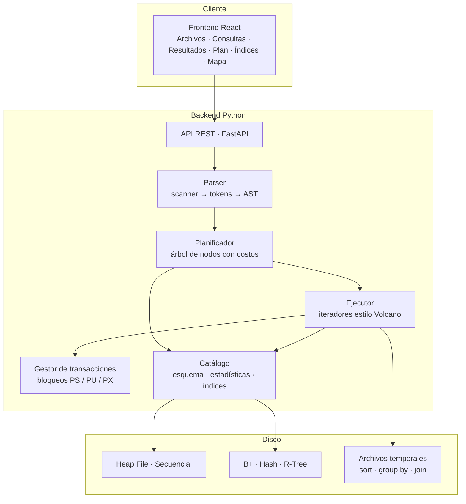
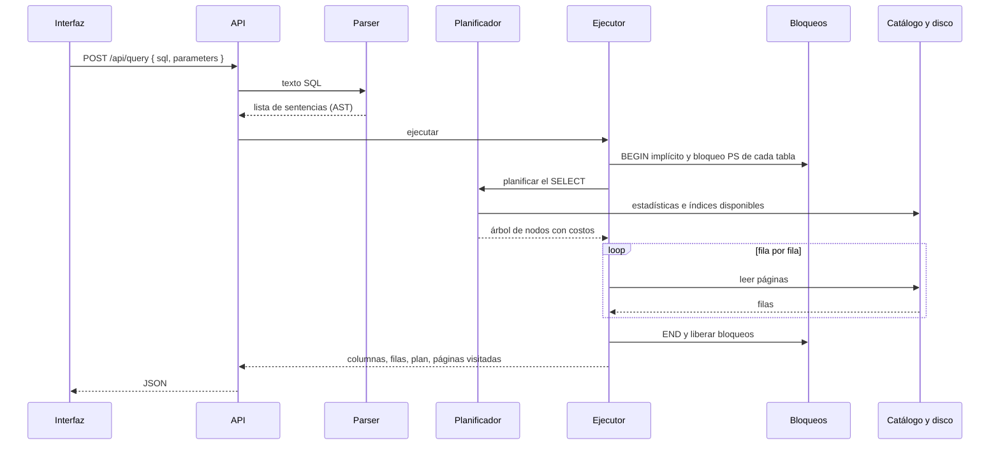

# 🧱 Arquitectura

## Capas



| Capa | Dónde está | Qué hace |
|---|---|---|
| API | `backend/api/main.py` | Recibe SQL, importa CSV, describe índices y borra la base |
| Parser | `backend/engine/parser/` | Convierte el texto en un AST con un parser descendente recursivo |
| Planificador | `backend/engine/plan/` | Elige métodos de acceso y arma el árbol de nodos con costos estimados |
| Ejecutor | `backend/engine/parser/executor.py` | Valida, toma bloqueos y recorre el árbol |
| Catálogo | `backend/engine/catalog.py` | Une el archivo de datos, los índices y las estadísticas de cada tabla |
| Almacenamiento | `backend/engine/storage/` | Heap File y archivo secuencial paginados |
| Índices | `backend/engine/bplus/`, `hashing/`, `rtree.py` | B+, hash extensible y R-Tree |
| Algoritmos externos | `backend/engine/external/`, `hashing/external_hash.py` | Ordenamiento, agrupación y JOIN que no caben en memoria |
| Transacciones | `backend/engine/transactions/` | Transacciones por hilo y gestor de bloqueos |

## Recorrido de una consulta



Cada nodo del árbol es un generador: la raíz pide una fila, el nodo la pide a sus hijos y así hasta llegar a disco. Mientras corre, cada nodo mide su tiempo y cuenta las páginas que toca. Con eso se arma `EXPLAIN ANALYZE` y se resalta el recorrido en la pestaña Índices.

## API REST

| Método | Ruta | Uso |
|---|---|---|
| `GET` | `/api/health` | Comprobar que el backend responde |
| `GET` | `/api/tables` | Tablas con columnas, índices, cantidad de filas y tipo de almacenamiento |
| `POST` | `/api/query` | Ejecutar SQL. Cuerpo: `{"sql": "...", "parameters": {"mi_ubicacion": [lat, lon]}}` |
| `POST` | `/api/tables/import` | Importar un CSV (`file`, `table_name`, `index_kind`, `index_field`) |
| `GET` | `/api/tables/{tabla}/index` | Nodos de un B+ o R-Tree (`column`, `page`, `depth`, `index`) |
| `GET` | `/api/tables/{tabla}/index/rects` | MBR de un R-Tree por nivel (`column`, `levels`) |
| `POST` | `/api/reset` | Borrar todas las tablas y sus archivos |

La respuesta de `/api/query` incluye, por sentencia, el plan, el árbol de `EXPLAIN`, los puntos para el mapa y las páginas de índice visitadas.

## Estructura del repositorio

```
backend/
├── api/main.py                  API REST
└── engine/
    ├── catalog.py               StorageTable, índices secundarios, estadísticas
    ├── importer.py              lectura de CSV e inferencia de tipos
    ├── rtree.py                 R-Tree en disco
    ├── spatial.py               distancias Haversine y Euclidiana
    ├── spatial_table.py         mantenimiento del R-Tree de cada tabla
    ├── storage/
    │   ├── heap/heapfile.py     Heap File
    │   └── sequential/          archivo secuencial paginado
    ├── bplus/
    │   ├── bplus_tree.py        B+ no agrupado
    │   └── clustered.py         B+ agrupado sobre el secuencial
    ├── hashing/
    │   ├── extendible_hash.py   hash extensible
    │   └── external_hash.py     GROUP BY y JOIN por hash externo
    ├── external/external_sort.py  ordenamiento externo k-way
    ├── parser/
    │   ├── tokens.py · scanner.py · sql_parser.py · nodes.py · visitor.py
    │   └── executor.py          ejecutor y validaciones
    ├── plan/
    │   ├── planner.py · nodos.py · costos.py · explain.py
    └── transactions/            manager, lock_manager, demo
frontend/src/
├── App.jsx
├── api/                         cliente HTTP
└── components/                  FilesPanel, QueryPanel, ResultsPanel, PlanPanel,
                                 ExplainTree, IndexPanel, MapPanel
benchmarks/                      benchmark.ipynb, spatial.py y resultados
data/                            generate_data.py (benchmarks), generar_demo.py (demo)
```

---

<div align="center">

[← SQL](02-sql.md) · [Inicio](../README.md) · [Almacenamiento →](04-almacenamiento.md)

</div>
