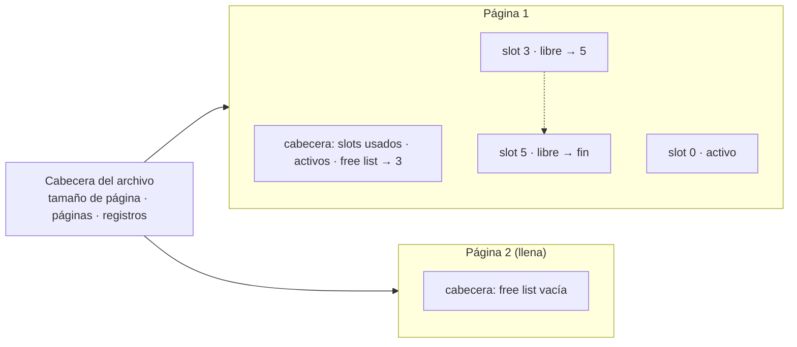
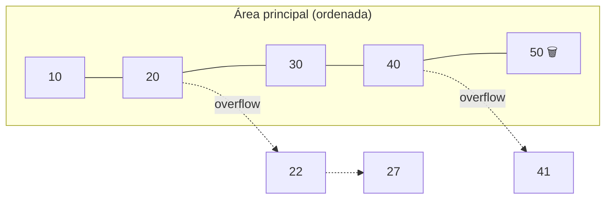
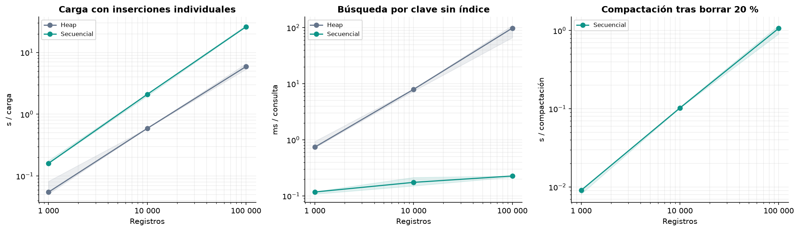

# 💾 Almacenamiento

Los archivos se dividen en **páginas de 4096 bytes** y los registros son de tamaño fijo, empaquetados con `struct`.

## Formato de registro

```
| col 1 | col 2 | ... | col n | mapa de NULL (8 B) |
```

- Cada columna ocupa siempre su tamaño: `INT` 4 B, `FLOAT` 4 B, `VARCHAR(n)` 4·n B, `POINT` 16 B.
- El **mapa de NULL** tiene un bit por columna: si el bit *i* está en 1, la columna *i* es nula y su espacio guarda un relleno.
- Las tablas creadas antes de este formato se abren sin el mapa y rechazan `NULL`.

Un registro se identifica por su **RID**: `(página, slot)` en el heap y la posición en el archivo secuencial.

## Heap File

Guarda los registros en el orden en que llegan. Es el almacenamiento de las tablas con índice `HASH` o `BPLUS`.



| Operación | Cómo funciona |
|---|---|
| Insertar | Usa un slot de la *free list* de alguna página; si no hay, el siguiente slot de la última página; si está llena, crea una página nueva. |
| Borrar | Enlaza el slot a la *free list* de su página. El último campo del slot distingue **activo** (`-1`) de **libre** (siguiente slot libre, o `-2` al final). |
| Buscar sin índice | Recorre todas las páginas: O(P). |
| Actualizar | Reescribe el registro en su mismo slot: el RID no cambia. |

### Mapa de espacio libre

Para no recorrer todas las páginas en cada inserción, el `Heapfile` mantiene en memoria un **min-heap con las páginas que tienen slots libres**:

- se construye una vez al abrir el archivo, leyendo cada cabecera de página;
- un borrado agrega su página;
- una inserción que gasta el último hueco de la página la quita.

Con eso, encontrar dónde insertar es **O(1)**, y se sigue reutilizando primero la página de menor número. Es la misma idea que el *free space map* de PostgreSQL. El formato del archivo no cambia: lo que persiste en disco son las free lists de cada página.

## Archivo secuencial paginado

Guarda los registros **ordenados por la clave**. Es el almacenamiento de las tablas `BPLUS_CLUSTERED`.



| Operación | Cómo funciona |
|---|---|
| Buscar | Búsqueda binaria en el área principal y luego la cadena de overflow del hueco. |
| Insertar | Se enlaza, en orden, en la cadena de overflow del hueco que le corresponde. |
| Borrar | Lazy: marca el registro como borrado y conserva la clave para la búsqueda binaria. |
| Reorganizar | Cuando `(borrados + overflow) / slots > 30 %`, reescribe todo ordenado en el área principal. |

## Heap vs. secuencial

| | Heap File | Secuencial |
|---|---|---|
| Insertar | O(1) | mantiene el orden; reorganiza cada cierto tiempo |
| Buscar por clave sin índice | O(P) | O(log P) |
| Recorrer en orden | requiere ordenar | ya está ordenado |
| Espacio | reutiliza slots libres | crece con overflow hasta reorganizar |
| Úsalo cuando | se escribe mucho o los accesos van por índice | se lee por clave o por rango de la clave |

Las mediciones están en [benchmarks](../benchmarks/README.md):



---

<div align="center">

[← Arquitectura](03-arquitectura.md) · [Inicio](../README.md) · [Índices →](05-indices.md)

</div>
