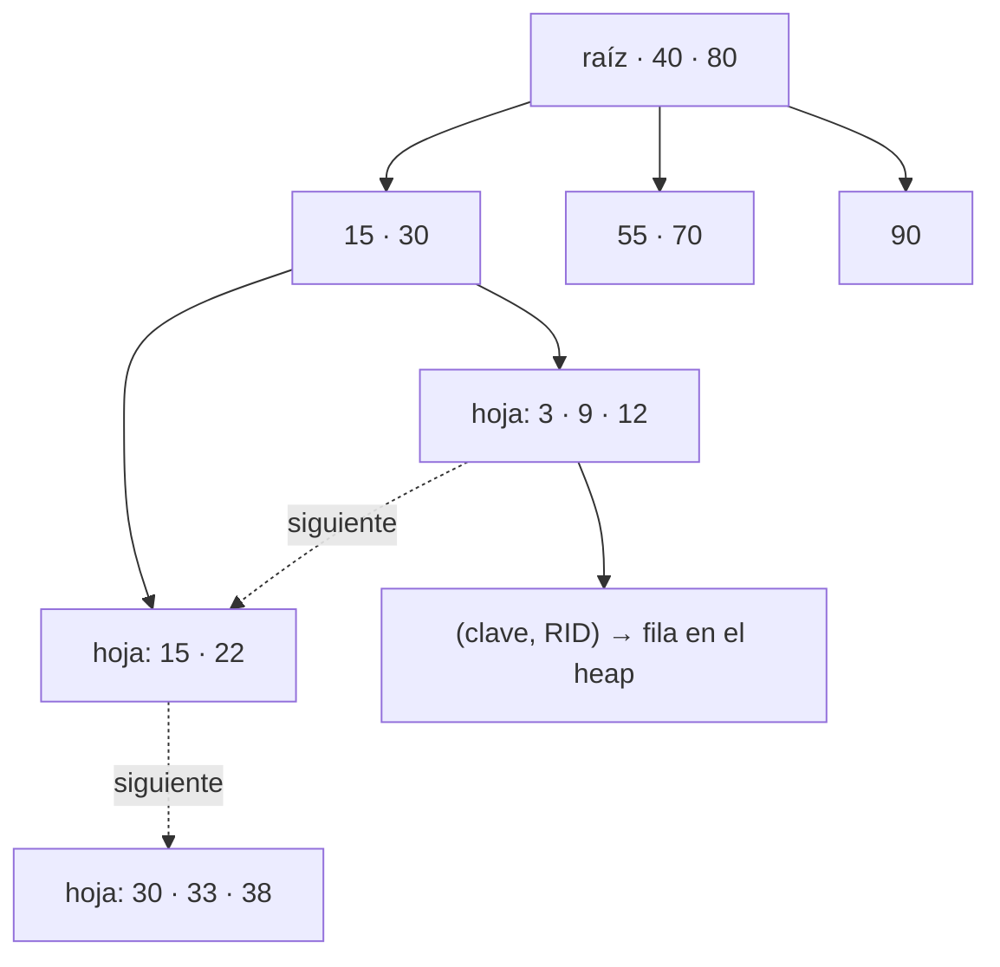
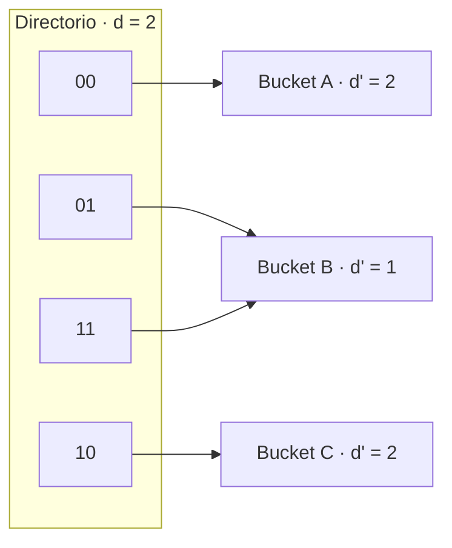
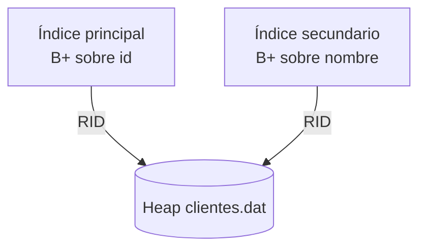
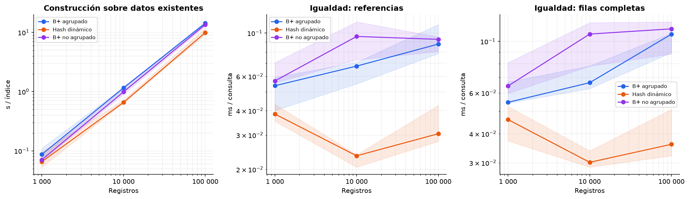
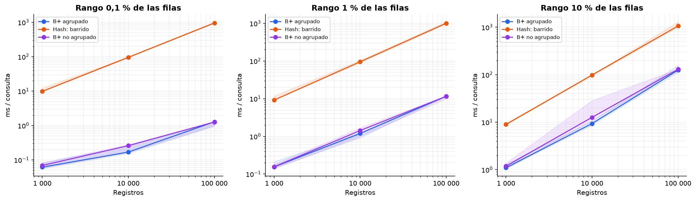
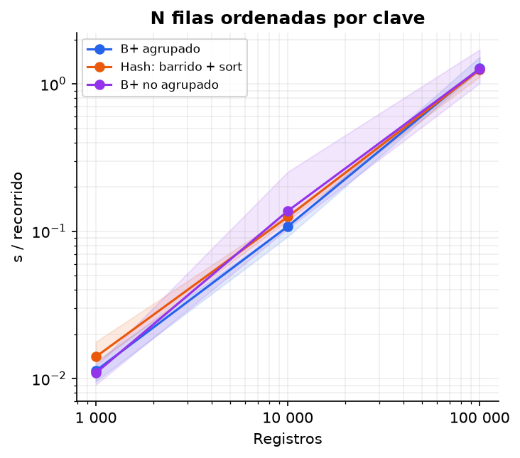
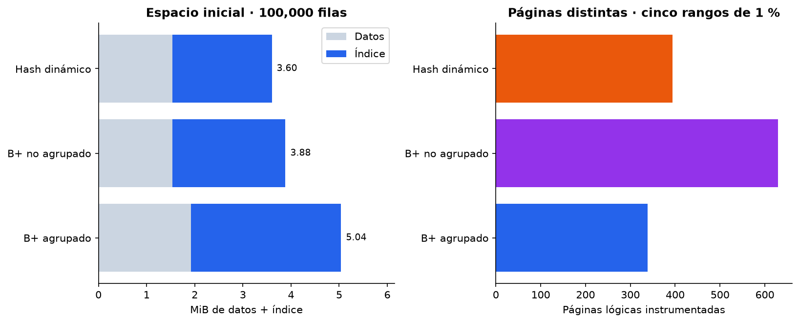
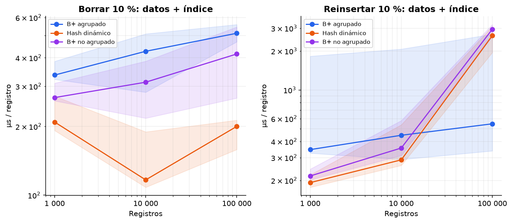

# 🌳 Índices

Todos los índices guardan sus nodos o buckets en páginas a través de `FileManager` y comparten la interfaz `insert`, `search`, `delete` y `bulk_load`. Cada tabla tiene:

- un **índice principal**, elegido en `CREATE TABLE ... USING` o al importar el CSV;
- cero o más **índices secundarios**, creados con `CREATE INDEX`;
- un **R-Tree** por cada columna `POINT`.

| | B+ agrupado | B+ no agrupado | Hash extensible | R-Tree |
|---|---|---|---|---|
| Igualdad | ✅ | ✅ | ✅ | |
| Rango y `BETWEEN` | ✅ páginas contiguas | ✅ un acceso por fila | | |
| Radio, k-NN, polígono | | | | ✅ |
| Como índice principal | ✅ | ✅ | ✅ | |
| Como índice secundario | | ✅ | ✅ | automático |
| Archivo de datos | secuencial | heap | heap | heap o secuencial |

## B+ no agrupado



- **Orden 32**: cada nodo guarda hasta 32 claves. Lo define `BLOCK_FACTOR` en `backend/engine/catalog.py` y queda guardado en el `.meta` de cada árbol.
- Las hojas guardan pares `(clave, RID)` y están enlazadas, para recorrer rangos.
- **Split**: un nodo con 33 claves se parte en 17 y 16. Con inserciones en orden de clave, la mitad izquierda ya no vuelve a llenarse y las hojas quedan cerca del 53 % de ocupación.
- **Claves repetidas**: la búsqueda y el borrado bajan por el primer hijo que puede contener la clave y avanzan por las hojas, así encuentran todas las repeticiones aunque un split las haya separado.
- **Rangos abiertos y sobre texto**: un límite ausente empieza en la hoja de más a la izquierda o recorre hasta la última.

## B+ agrupado

- El mismo B+, pero sus hojas apuntan a **posiciones del archivo secuencial**, que está ordenado por la misma clave: el orden físico coincide con el lógico.
- Un rango baja una vez por el árbol y luego lee **páginas contiguas**.
- Si el secuencial se reorganiza, las posiciones cambian y el árbol se reconstruye.
- Solo puede ser índice principal: una tabla tiene un único orden físico.

## Hash extensible



- Directorio de 2^d punteros y buckets de 32 entradas, cada uno con su profundidad local d'.
- Si un bucket se llena y d' = d, se duplica el directorio; luego el bucket se divide y sus entradas se redistribuyen.
- Si todas las claves del bucket son iguales y no se puede dividir, se encadena un bucket de overflow.
- Solo resuelve igualdad.

## Índices secundarios

```sql
CREATE INDEX idx_clientes_nombre ON clientes (nombre);
CREATE INDEX idx_pedidos_estado ON pedidos (estado) USING HASH;
DROP INDEX idx_clientes_nombre;
```



- Guardan pares `(valor, RID)` en archivos propios (`<tabla>__<índice>.*`). Su definición queda en el descriptor de la tabla, así que sobreviven a un reinicio.
- Se mantienen solos: `INSERT` agrega la entrada, `DELETE` la quita y `UPDATE` la mueve solo si cambió la columna indexada.
- Las filas con valor `NULL` no se indexan.
- En tablas agrupadas, el RID es la posición en el secuencial y el índice se reconstruye cuando el secuencial se reorganiza.
- Se rechaza:
  - un nombre repetido;
  - una columna `POINT`, que ya tiene su R-Tree;
  - `USING BPLUS_CLUSTERED`;
  - repetir el mismo tipo de índice sobre la misma columna.
- `DROP INDEX` solo elimina índices creados con `CREATE INDEX`.

El planificador estima el costo de cada índice que sirve a la condición y usa el más barato. Ver [Planificador](06-planificador.md#elección-del-método-de-acceso).

## R-Tree

El índice de las columnas `POINT`, en disco y con la misma idea que el B+. Está descrito en [Consultas espaciales](08-espacial.md#r-tree).

## Ver los índices por dentro

La pestaña **Índices** de la interfaz muestra los nodos de cualquier B+ (principal o secundario) o R-Tree y resalta en naranja las páginas que visitó la última consulta. Ver [Interfaz](09-interfaz.md#índices).

## Comparación experimental

Los resultados completos están en [benchmarks](../benchmarks/README.md).

| Igualdad | Rangos |
|---|---|
|  |  |

| Recorrido ordenado | Espacio |
|---|---|
|  |  |



---

<div align="center">

[← Almacenamiento](04-almacenamiento.md) · [Inicio](../README.md) · [Planificador y EXPLAIN →](06-planificador.md)

</div>
