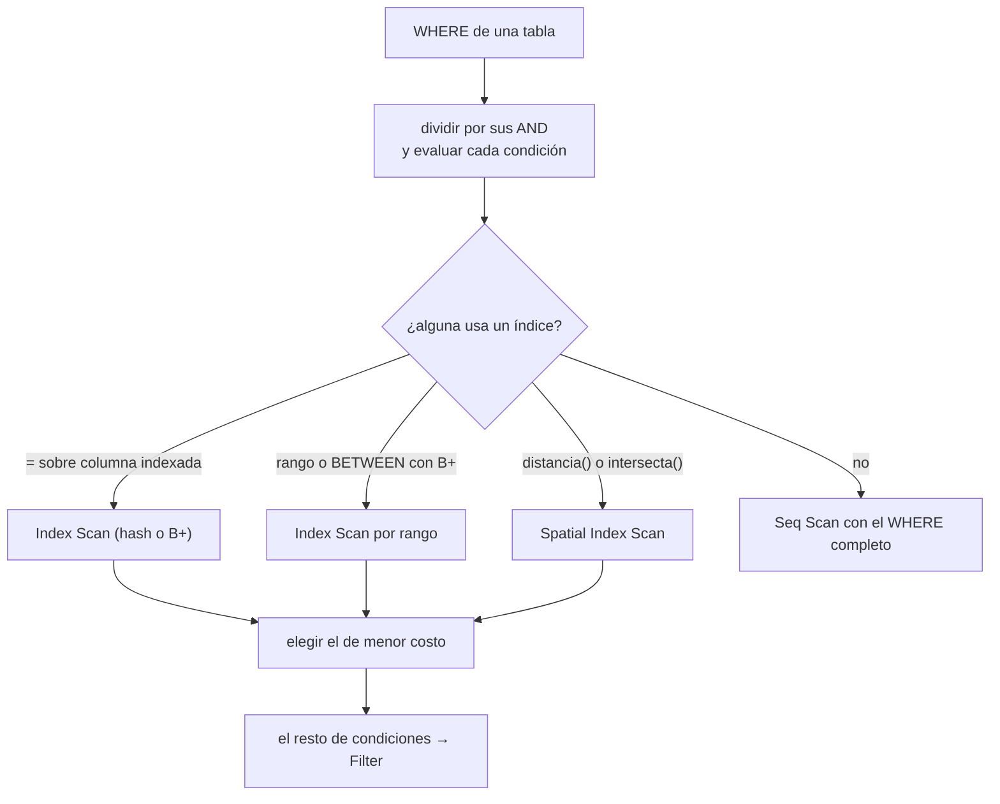
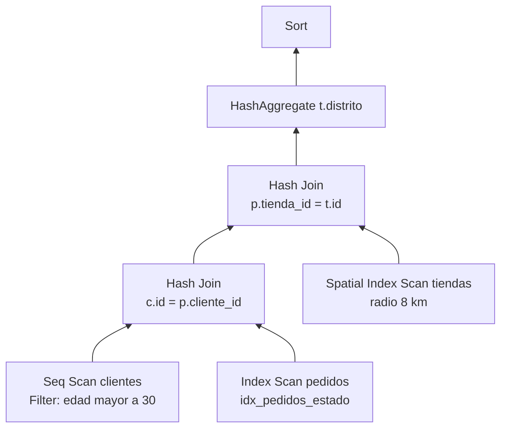
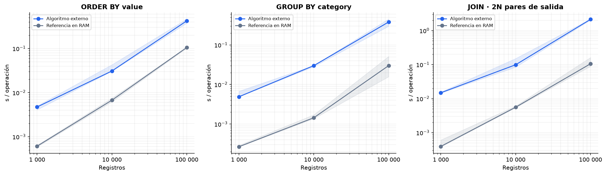

# 🧠 Planificador y EXPLAIN

Antes de ejecutar, el planificador convierte el AST en un **árbol de nodos físicos**, cada uno con su costo y sus filas estimadas, igual que PostgreSQL. El ejecutor recorre ese árbol fila por fila.

## Nodos

| Nodo | Qué hace |
|---|---|
| `Seq Scan` | Recorre todas las páginas, con filtro opcional |
| `Index Scan` | Busca por igualdad o rango en un B+ o hash, principal o secundario |
| `Spatial Index Scan` | Busca en el R-Tree por radio, k-NN o polígono |
| `Filter` | Aplica condiciones que el acceso no resolvió |
| `Hash Join` | Grace hash join externo |
| `HashAggregate` / `Aggregate` | `GROUP BY` y agregaciones con hash externo |
| `Sort` | Ordenamiento externo k-way o top-N heapsort |
| `Limit` | Corta después de *k* filas |
| `Insert` / `Update` / `Delete` | Modifican la tabla con las filas de su hijo |

## Elección del método de acceso



- Si varios índices sirven (el principal, los secundarios o el R-Tree), se elige el de **menor costo estimado**.
- `OR`, `IN`, `LIKE`, `IS NULL` y la comparación entre columnas se evalúan como filtro.
- La evaluación usa lógica de tres valores: verdadero, falso o desconocido (`NULL`). Solo pasan las filas verdaderas.

## JOIN de varias tablas



- **Árbol profundo a la izquierda**, en el orden en que se escriben los `JOIN`.
- **Filtros bajados**: el `WHERE` se divide por sus `AND`. Cada condición que toca una sola tabla se aplica en el acceso a esa tabla, donde puede usar sus índices. Las que mezclan tablas, como `c.distrito = t.distrito`, se aplican después del último `JOIN`.
- **Estimación de filas**, la misma fórmula de PostgreSQL:

  `filas = |R| · |S| / max(n_distinct(R.x), n_distinct(S.y))`

  Cada `n_distinct` se acota por las filas de su entrada. El resultado del `JOIN` hereda las estadísticas de las tablas base, así que el `GROUP BY` posterior también se estima.

## Estadísticas y costos

`ANALYZE tabla` guarda por columna:
- el mínimo y el máximo;
- la cantidad de valores distintos;
- la fracción de `NULL`;
- para `POINT`, el rectángulo que encierra los puntos.

Se recalcula sola cuando los cambios superan `50 + 0.1·N` filas.

| Condición | Selectividad |
|---|---|
| `col = v` | 1 / n_distinct |
| `col < v`, `BETWEEN` | fracción lineal entre mínimo y máximo |
| `IS NULL` | fracción de nulos |
| `AND` / `OR` / `NOT` | producto · 1 − ∏(1 − sᵢ) · 1 − s |
| Sin estadísticas | 0.005 para igualdad y 1/3 para rangos (valores de PostgreSQL) |

Las constantes de costo son las de PostgreSQL: página secuencial 1, página aleatoria 4, por fila 0.01 y por operador 0.0025. El costo de un índice usa su altura y su factor de bloque reales.

## Algoritmos externos

El ejecutor trabaja con un presupuesto de **32 filas en memoria**; lo que excede va a archivos temporales.

| Operación | Algoritmo |
|---|---|
| `ORDER BY` | Runs de 32 filas ordenados en memoria y mezcla k-way. Con `LIMIT k ≤ 32`, top-N heapsort sin escribir runs. |
| `GROUP BY` | Hash en memoria si los grupos caben; si no, 16 particiones en disco procesadas de forma recursiva. |
| `JOIN` | Grace hash join: ambas entradas se particionan en 16 archivos y se une cada par con una tabla hash. |



## EXPLAIN y EXPLAIN ANALYZE

- `EXPLAIN` muestra el árbol con costos y filas estimadas, **sin ejecutar**.
- `EXPLAIN ANALYZE` lo ejecuta y agrega, por nodo:
  - tiempo real;
  - filas reales;
  - `Buffers`: `read` = páginas distintas, `hit` = accesos repetidos;
  - detalles como `Rows Removed by Filter` o `Sort Method`.

```
Sort  (cost=1.71..1.72 rows=3 width=16) (actual time=0.642..0.686 rows=3 loops=1)
  Sort Key: categoria
  Sort Method: external k-way merge  Runs: 1  Memory: 32 rows
  Buffers: shared hit=40 read=2
  ->  HashAggregate  (cost=1.66..1.69 rows=3 width=16) (actual time=0.440..0.446 rows=3 loops=1)
        Group Key: categoria
        ->  Seq Scan on ventas  (cost=0.00..1.50 rows=32 width=44) (actual time=0.042..0.379 rows=30 loops=1)
              Filter: (monto > 300)
              Rows Removed by Filter: 10
Planning Time: 0.106 ms
Execution Time: 0.699 ms
```

Cómo leerlo:
- `cost=inicio..total` está en las unidades de costo y `rows` es la estimación.
- `actual time` está en milisegundos y es **inclusivo**: el tiempo de un nodo incluye el de sus hijos.
- Si la estimación y la realidad difieren 10 veces o más, la pestaña **Plan** de la interfaz lo marca.

---

<div align="center">

[← Índices](05-indices.md) · [Inicio](../README.md) · [Transacciones →](07-transacciones.md)

</div>
