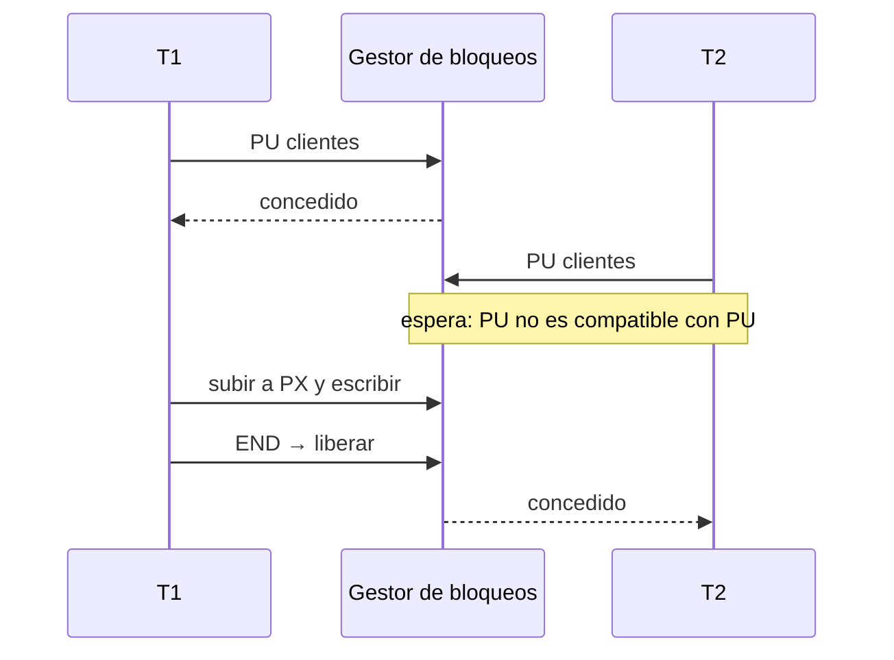

# 🔒 Transacciones y concurrencia

## Modelo

- `BEGIN TRANSACTION` y `END TRANSACTION` agrupan sentencias. Una sentencia suelta corre en una **transacción implícita**.
- Cada hilo tiene su propia transacción activa.
- **2PL estricto**: los bloqueos se toman a medida que se necesitan y se liberan todos juntos en `END`.
- No hay `ROLLBACK`: una transacción no deshace lo que ya escribió.

## Modos de bloqueo

Los bloqueos son a nivel de tabla:

| Modo | Lo toma |
|---|---|
| **PS** · compartido | `SELECT`, sobre cada tabla de la consulta, incluidas las de un `JOIN`, en orden alfabético |
| **PU** · actualización | `UPDATE` y `DELETE` mientras buscan las filas; antes de escribir suben a PX |
| **PX** · exclusivo | `INSERT`, `ANALYZE` y la escritura de `UPDATE` y `DELETE` |
| **PX sobre el catálogo** | `CREATE TABLE`, `DROP TABLE`, `CREATE INDEX` y `DROP INDEX` |

Compatibilidad (fila: el bloqueo que ya existe; columna: el que se pide):

| | PS | PU | PX |
|---|:---:|:---:|:---:|
| **PS** | ✅ | ✅ | ❌ |
| **PU** | ✅ | ❌ | ❌ |
| **PX** | ❌ | ❌ | ❌ |

- PU deja leer mientras se buscan las filas, pero impide que otra transacción también se prepare para escribir. Eso evita el interbloqueo típico de dos transacciones que leen y luego quieren escribir.
- Un bloqueo incompatible **espera hasta 5 s**; si vence, la sentencia falla con un error.
- No hay detección de interbloqueos: el tiempo de espera los corta.



## Simulación con hilos

`backend/engine/transactions/demo.py` muestra una actualización perdida y cómo los bloqueos la evitan. Una página empieza en 100; un hilo suma 50 y otro resta 30, así que el resultado correcto es 120.

```bash
cd backend
.venv/bin/python -m engine.transactions.demo
```

```
Escenario sin bloqueos
Resultado esperado: 120
Resultado obtenido: 70
Actualización perdida: True

Escenario con bloqueos
Resultado esperado: 120
Resultado obtenido: 120
Espera detectada: True
```

Sin bloqueos, los dos hilos leen 100 y la escritura del segundo pisa la del primero. Con bloqueos, el segundo espera a que el primero termine.

## Dónde está el código

| Archivo | Contenido |
|---|---|
| `transactions/manager.py` | `TransactionManager`: transacción activa por hilo, `begin`, `acquire`, `end` |
| `transactions/lock_manager.py` | `LockManager`: modos, compatibilidad, conversión PU → PX, espera con `threading.Condition` e historial |
| `transactions/models.py` · `resources.py` | Modos y estados; un recurso es un par (tipo, nombre), por ejemplo `(table, clientes)` o `(catalog, tables)` |
| `parser/executor.py` | Pide cada bloqueo según la sentencia |

---

<div align="center">

[← Planificador y EXPLAIN](06-planificador.md) · [Inicio](../README.md) · [Consultas espaciales →](08-espacial.md)

</div>
