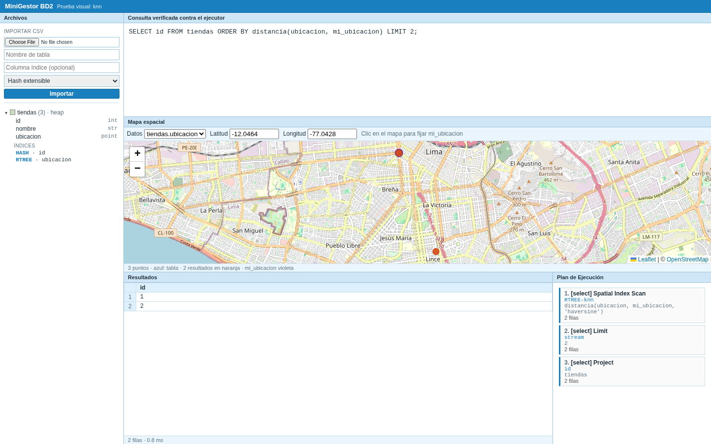
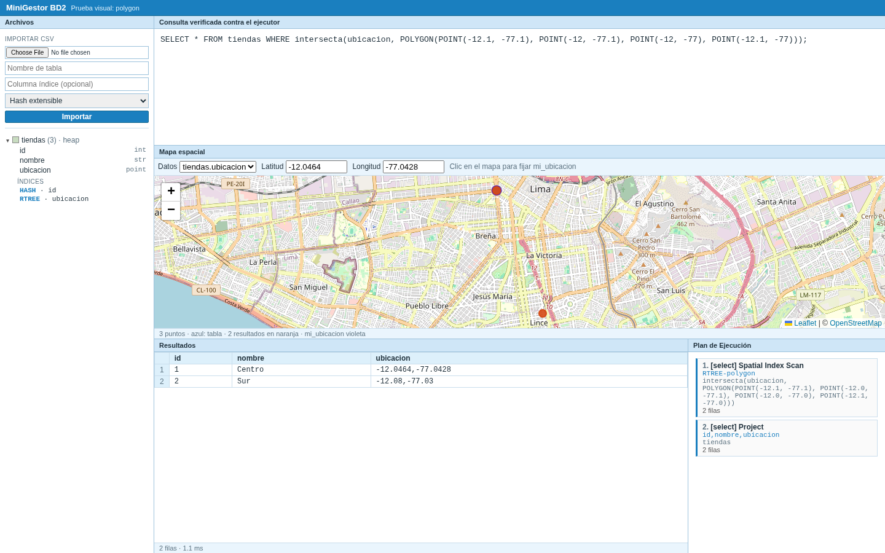
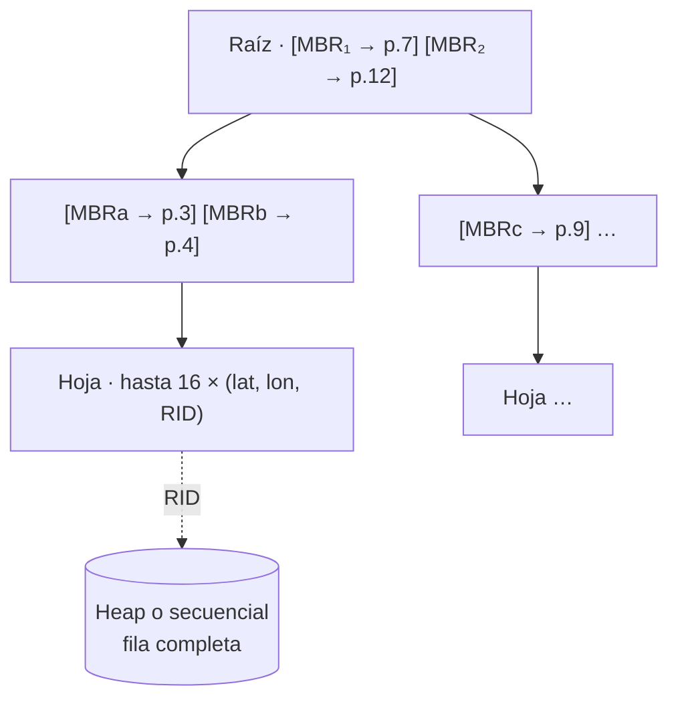

# 🗺️ Consultas espaciales

## El tipo POINT

```sql
CREATE TABLE tiendas (id INT PRIMARY KEY, nombre VARCHAR(30), ubicacion POINT);
INSERT INTO tiendas VALUES (1, 'Centro', POINT(-12.0464, -77.0428));
```

- `POINT(latitud, longitud)` en grados.
- Al importar un CSV, una columna con valores `POINT(lat, lon)` o `POINT(lat lon)` se reconoce como `POINT`.
- Cada columna `POINT` recibe automáticamente un **R-Tree**.

## Funciones

| Consulta | SQL | Plan |
|---|---|---|
| Radio | `WHERE distancia(ubicacion, POINT(-12.05, -77.04)) < 5000` | `Spatial Index Scan` · radius |
| k vecinos | `ORDER BY distancia(ubicacion, mi_ubicacion) LIMIT 10` | `Spatial Index Scan` · knn |
| k vecinos con filtro | `WHERE tipo = 'bodega' ORDER BY distancia(...) LIMIT 10` | k-NN incremental + `Filter`, o top-N si cuesta menos |
| Polígono | `WHERE intersecta(ubicacion, POLYGON(POINT(..), POINT(..), POINT(..)))` | `Spatial Index Scan` · polygon |

- `mi_ubicacion` es un parámetro que envía la interfaz: el punto que eliges con un clic en el mapa.
- Con `AND`, la condición espacial compite por costo con los demás índices y, en un `JOIN`, baja a la tabla de su columna.
- `distancia(...) BETWEEN a AND b` se evalúa como filtro, sin índice.

<table>
<tr>
<td><br><sub>Radio</sub></td>
<td><br><sub>k vecinos más cercanos</sub></td>
<td><br><sub>Polígono</sub></td>
</tr>
</table>

## Métricas

| Métrica | Fórmula | Unidad |
|---|---|---|
| **Haversine** (por defecto) | `d = 2R·asin(√(sin²(Δφ/2) + cos φ₁ · cos φ₂ · sin²(Δλ/2)))`, R = 6 371 000 m | metros |
| **Euclidiana** | `d = √((φ₁−φ₂)² + (λ₁−λ₂)²)` | grados |

La métrica se elige con un tercer argumento: `distancia(a, b, 'euclidean')`.

## R-Tree



- **En disco, como el B+**: cada nodo es una página de 664 bytes en `<tabla>_<columna>_rtree.nodes`; la raíz, la altura y el tamaño van en `.meta`. Al reiniciar se abre sin recorrer la tabla.
- Capacidad M = 16 y mínimo m = 8.
- **Inserción**: baja por el hijo cuyo MBR crece menos. Si un nodo pasa de 16 entradas, aplica *split cuadrático*, que puede subir hasta la raíz.
- **Borrado**: un nodo con menos de 8 entradas se elimina y sus entradas se reinsertan.
- **Carga masiva STR**: al importar o reconstruir, arma el árbol escribiendo cada página una sola vez.
- Las filas con `POINT` nulo no se indexan. En un k-NN cuyo `LIMIT` supera los puntos indexados, esas filas salen al final.

### Cómo responde cada consulta

| Consulta | Algoritmo |
|---|---|
| Radio | El círculo se convierte en un rectángulo de grados, se baja solo por los MBR que lo intersectan y cada candidato se filtra con la distancia exacta. |
| k-NN | Best-first: cola de prioridad por la distancia mínima posible a cada MBR (*MINDIST*). Termina cuando el siguiente MBR está más lejos que el k-ésimo vecino. |
| k-NN incremental | Entrega los vecinos uno a uno en orden de distancia, para combinarlo con un `WHERE`. |
| Polígono | Candidatos por el MBR del polígono y prueba exacta con *ray casting*; los puntos del borde cuentan como dentro. |

La cota de Haversine sobre un MBR nunca supera la distancia real, así que la poda del k-NN es correcta.

## Rendimiento

Comparación contra un barrido secuencial y contra GiST de PostgreSQL, con 1 000, 10 000 y 100 000 puntos. El detalle está en [RESULTADOS_ESPACIALES.md](../benchmarks/RESULTADOS_ESPACIALES.md) y la metodología en [README_espacial.md](../benchmarks/README_espacial.md).


---

<div align="center">

[← Transacciones](07-transacciones.md) · [Inicio](../README.md) · [Interfaz →](09-interfaz.md)

</div>
