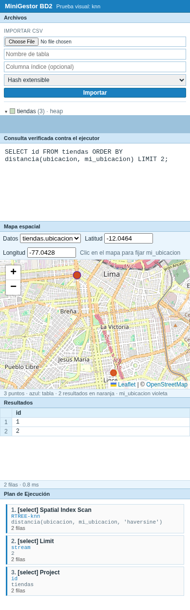

# 🖥️ Interfaz

La interfaz está en <http://localhost:5173> y se organiza en paneles:

```
┌──────────┬───────────────────────────────────────────────┐
│          │ Consultas: editor SQL · Ejecutar · Explain    │
│ Archivos ├───────────────────────────────────────────────┤
│          │ Mapa espacial (solo en consultas espaciales)  │
│ tablas   ├──────────────────────────────┬────────────────┤
│ índices  │ Resultados │ Plan │ Índices  │ Plan de        │
│ importar │                              │ ejecución      │
└──────────┴──────────────────────────────┴────────────────┘
```

## Archivos

- Lista las tablas con su cantidad de filas, el tipo de almacenamiento (heap o secuencial), sus columnas y sus índices: principal, secundarios y R-Tree.
- **Importar CSV**: archivo, nombre de tabla, columna índice y tipo de índice. Los tipos se infieren solos (`INT`, `FLOAT`, texto o `POINT`) y una celda vacía se guarda como `NULL`.
- **Borrar base de datos**: elimina todas las tablas y sus archivos, con confirmación.
- El botón ◂ pliega el panel a una franja lateral.

## Consultas

Editor SQL, ejemplos listos para probar y tres botones: **Ejecutar**, **Explain** y **Explain Analyze**.

## Resultados

Tabla de filas con el tiempo de la consulta. Los `NULL` se muestran en cursiva.

## Plan

Se abre solo después de un `EXPLAIN`.

- Dibuja el árbol **en horizontal**, como pgAdmin: las filas fluyen de derecha a izquierda.
- Cada nodo muestra costo, filas estimadas y, con `ANALYZE`, filas y tiempo reales, páginas leídas y una barra con su tiempo propio.
- Marca los nodos donde la estimación difiere 10 veces o más de la realidad.
- **Zoom**: botones − y +, el porcentaje para volver al 100 %, **Ajustar** para que entre todo el árbol, y Ctrl + rueda del mouse.
- **Texto** muestra la misma salida que `psql`.

## Índices

- Elige cualquier B+ (principal o secundario) o R-Tree y muestra sus páginas como árbol.
- Los nodos se cargan bajo demanda al expandirlos.
- Al hacer clic en un nodo se ven sus claves y RID, o sus MBR y puntos en el caso del R-Tree.
- Después de una consulta, **resalta en naranja las páginas que visitó** y abre ese camino.
- Para un R-Tree, puede dibujar en el mapa los rectángulos de cada nivel.

## Mapa espacial

- Aparece con consultas que usan `distancia` o `intersecta`, o al dibujar los MBR de un R-Tree.
- Muestra todos los puntos de la tabla en azul, los resultados en naranja y `mi_ubicacion` en violeta.
- Un clic fija `mi_ubicacion`; también se puede escribir la latitud y la longitud.
- El chevron ▾ del encabezado lo pliega.



## Plan de ejecución

Panel lateral con la traza de pasos ejecutados (método, detalle y filas) y los tiempos de planificación y ejecución de un `EXPLAIN`.

## En el celular

En pantallas angostas los paneles se apilan en una sola columna y se pueden recorrer con scroll.

<br clear="right">

---

<div align="center">

[← Consultas espaciales](08-espacial.md) · [Inicio](../README.md) · [Pruebas →](10-pruebas.md)

</div>
